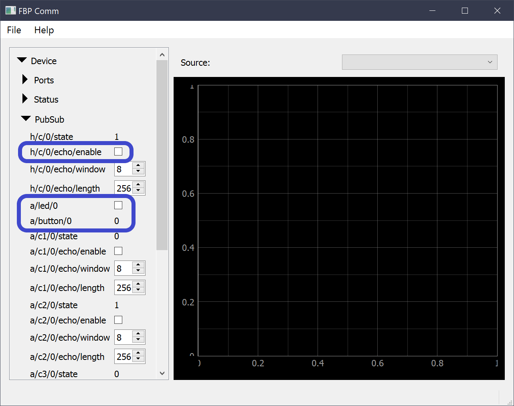

<!--
# Copyright 2014-2021 Jetperch LLC
#
# Licensed under the Apache License, Version 2.0 (the "License");
# you may not use this file except in compliance with the License.
# You may obtain a copy of the License at
#
#     http://www.apache.org/licenses/LICENSE-2.0
#
# Unless required by applicable law or agreed to in writing, software
# distributed under the License is distributed on an "AS IS" BASIS,
# WITHOUT WARRANTIES OR CONDITIONS OF ANY KIND, either express or implied.
# See the License for the specific language governing permissions and
# limitations under the License.
-->

# Welcome!

Welcome to the [Fitterbap](https://github.com/jetperch/fitterbap_ 
STM32G4 example!  This example targets the STM32G4 microcontrollers from
STMicroelectronics.  The official release targets the NUCLEO-G491RE,
a $21 USD development board.


## Getting started

The easiest way to get started is with a 
[NUCLEO-G491RE](https://www.st.com/en/evaluation-tools/nucleo-g491re.html).

Here's how:

1. Download the latest binary release from GitHub
2. Copy the bin file to your NUCLEO as a USB mass storage device
3. Install [python](https://www.python.org/downloads/) 3.8 or newer for your platform,
   if it's not already installed
4. `pip3 install pyfitterbap`
5. `pyfitterbap comm_ui`

In the pyfitterbap Comm UI, select the comm port for your Nucleo board.
Expand the Device → PubSub.  Toggle the `a/led/0` checkbox to toggle the
LED on the board.  Press the blue USER button on the board, and
note the change in `a/button/0`.  You can also perform an echo test
by clicking `h/c/0/echo/enable`.  Expand Status to see the data.



## NUCLEO-G491RE

The [NUCLEO-G491RE](https://www.st.com/en/evaluation-tools/nucleo-g491re.html)
development board contains the 
[STM32G491RE](https://www.st.com/content/st_com/en/products/microcontrollers-microprocessors/stm32-32-bit-arm-cortex-mcus/stm32-mainstream-mcus/stm32g4-series/stm32g4x1/stm32g491re.html)
Cortex-M4 microcontroller with 128 kB RAM and 512 kB flash,
which provides plenty of room for a Fitterbap demonstration.  The
default code runs the Fitterbap comm protocol on all 5 UARTS, simultaneously,
to allow for extensive testing of Fitterbap's distributed 
Publish-Subscribe (PubSub) implementation.

This demonstration uses the following USART ports:

| Port   | Mode   | TX pin | RX pin | TX conn        | RX conn        | 
| ------ | ------ | ------ | ------ | -------------- | -------------- |
| USART1 | Server | PA9    | PA10   | CN10.1, CN5.1  | CN10.33, CN9.3 |
| USART2 | Client | PA3    | PA2    | USB VCP        | USB VCP        |
| USART3 | Server | PB10   | PB11   | CN10.25, CN9.7 | CN10.18        |
| USART4 | Client | PC10   | PC11   | CN7.1          | CN7.2          |
| USART5 | Server | PC12   | PD2    | CN7.3          | CN7.4          |

All ports are 3,000,000 baud, no parity, 8 data bits, 
and one stop bit (N81).

When wiring together two boards, connect a server port
to a client port.  Connect server.TX to client.RX and
server.RX to client.TX.

The ID pins allow you to select the board prefix:

| Bit  | Pin   | Nucleo Pin(s) |
| ---- | ----- | ------------- |
| 0    | PB0   | CN7.34, CN6.4 |
| 1    | PB1   | CN10.24       |
| 2    | PB2   | CN10.22       |

Note that +3.3V is CN7.16 and CN6.4.

The software prefix is 'a' + the 3-bit ID value. 
All ID pins are configured with pull-down resistors to
default to 0.


## Building

This project uses CMake to generate the build system.  You will need:

* [CMake](https://cmake.org/)
* The build system of your choice, such as [ninja](https://ninja-build.org/)
* The compiler, [gcc-arm-none-eabi](https://developer.arm.com/tools-and-software/open-source-software/developer-tools/gnu-toolchain/gnu-rm/downloads)
* [openocd](http://openocd.org/) (optional - for debugging)

On Windows:
```
cd {your_path_to}\fitterbap_example_stm32g4
set PATH=C:\bin\arm_none_eabi\10_2020-q4-major\bin;C:\Program Files\CMake\bin;C:\Windows\System32;C:\bin
mkdir build && cd build
cmake -G Ninja  ..
cmake --build .
```

The build directory should now contain `fitterbap_example_stm32g4.bin`,
which you can copy using the mass storage device.  You can also use
openocd to debug.

These instructions assume that you unzipped Ninja to c:\bin.
You will need to change the last path entry to the directory with ninja. 


## Licenses

All original code is under the permissive Apache 2.0 license.
However, this repo also contains ST code released under the 3-clause BSD
license.
